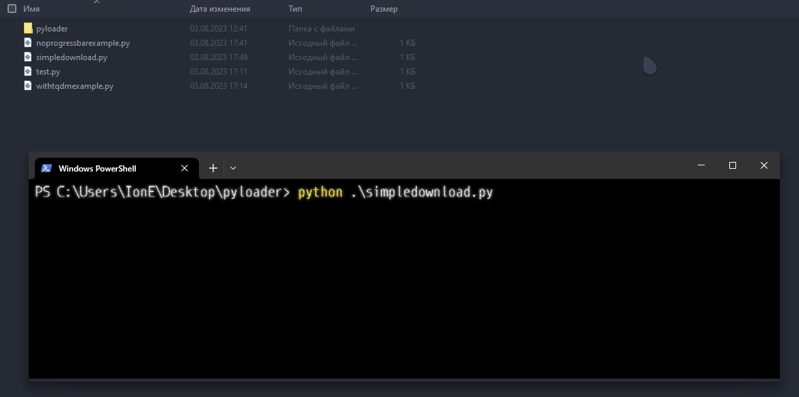
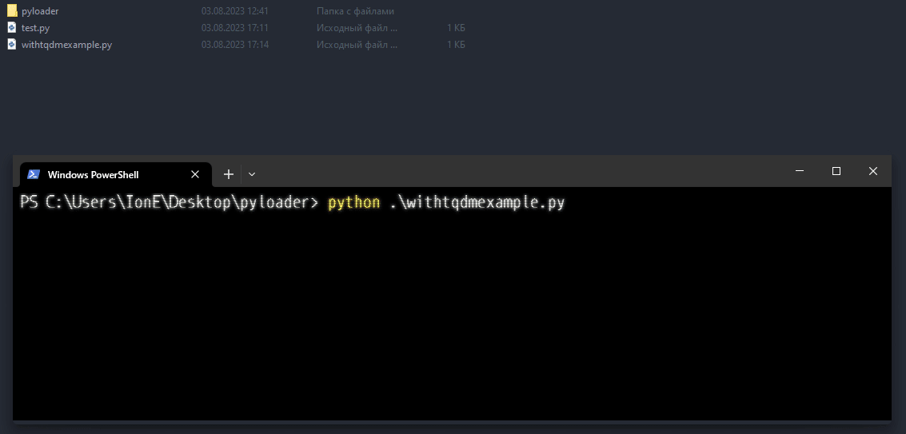

# PyLoader. 
Python library for downloading files by URL's. Fast and easy. Uses only Python STDLIB.<br>

Installation:
Install PyLoader and move it to your project directory.

## Examples.
### Simple download.
```python
from pyloader import PyLoader


url = 'https://yt3.ggpht.com/1yafclomM37uN64INRwmmWPC7kT0OXwx6W5Or4JRs5eRrlGAXYD2x6thKfyrK_mf493GkScfUV5P7g=s742-nd-v1'
out = 'pic.png'

file = PyLoader.download(url, out)

print(f'{out} downloaded.')
```



### No progress bar download.
```python
from pyloader import PyLoader


url = 'https://yt3.ggpht.com/1yafclomM37uN64INRwmmWPC7kT0OXwx6W5Or4JRs5eRrlGAXYD2x6thKfyrK_mf493GkScfUV5P7g=s742-nd-v1'
out = 'pic.png'

file = PyLoader.pdownload(url, out)

for data in file:
    print(PyLoader.util_format(data))

```


### TQDM Progress Bar.
```python
from pyloader import PyLoader

from tqdm import tqdm


url = 'https://yt3.ggpht.com/1yafclomM37uN64INRwmmWPC7kT0OXwx6W5Or4JRs5eRrlGAXYD2x6thKfyrK_mf493GkScfUV5P7g=s742-nd-v1'
out = 'pic.png'

pic = PyLoader.pdownload(url, out)

progress_bar = tqdm()

for download_info in pic:
    if download_info:
        if progress_bar.total == None:
            progress_bar.total = download_info['totalbytes']

        progress_bar.update(download_info['size_written'])
```



As you see, using PyLoader is very easy.

<hr>

# PyLoader Documentation.
```
# Static Functions & Variables (from pyloader import ...).
VERSION = 1.0

_percentage(current: int, maximal: int, _round: bool=False) -> int
_convsize(_bytes: int, chunk: int=1024) -> str

# PyLoader Functions & Variables (from pyloader import PyLoader).
# All PyLoader functions and variables are static. It means you can call functions without initializing PyLoader.
PyLoader.CHUNK = 1024

@staticmethod PyLoader.download(url: str, out: str) -> bool
@staticmethod PyLoader.pdownload(url: str, out: str, round_progress: bool=False) -> dict

@staticmethod PyLoader.util_format(download_info: Union[bool, dict]) -> Union[bool, str]

@staticmethod PyLoader.update_chunk(new_chunk: int) -> None
```

```VERSION```: Version of PyLoader.

```_percentage```: Calculate percentage. (_percentage:47, 100, True) -> 10%.
```_convsize```: Converting bytes into another file sizes. (_convsize:1024) -> 1.0kb.

```PyLoader.CHUNK```: PyLoader default download chunk.

```PyLoader.download```: The "simple" download. Downloads file from URL into {out}. Already handles exceptions: HTTPError, URLError, SSLCertVerificationError, ValueError.<br>
```PyLoader.pdownload```: Download file with ability to track things like: already downloaded percentage, downloaded bytes, file size, etc.<br><br>Yields ('yield [value]' in Python) dict with these values:<br>percentage (downloaded percentage),<br>current_progress (current progress - downloaded bytes),<br>size_written (bytes was written in this chunk loading),<br>size (size of file),<br>totalbytes (size of file in bytes),<br>chunk (chunk),<br>time_wasted (wasted time to load chunk in nanoseconds),<br>success (is chunk loaded successfully).<br><br>
Also handles exceptions: HTTPError, RequestHTTPError, RequestConnectionError, MissingSchema, (SSLError?).

```PyLoader.util_format```: Format download information. Converts dictionary with information to string. If ```download_info``` (first argument) is bool, function will return the same bool.

```PyLoader.update_chunk```: Update default PyLoader chunk.

### Notes.
You can customize your progress bar just by using values from download information, you also can customize messages, etc by yourself, how to do it: ```util_format``` source code.<br>
You also can use PyLoader static functions like _percentage, for your goals. These functions can be really useful.<br>
Report any errors to project issues.

<hr>
<p align="center">PyLoader MIT License v1.0.</p>
